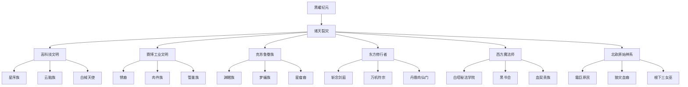
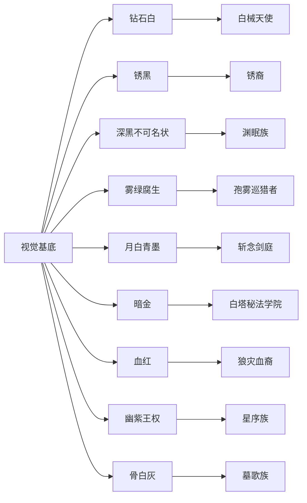
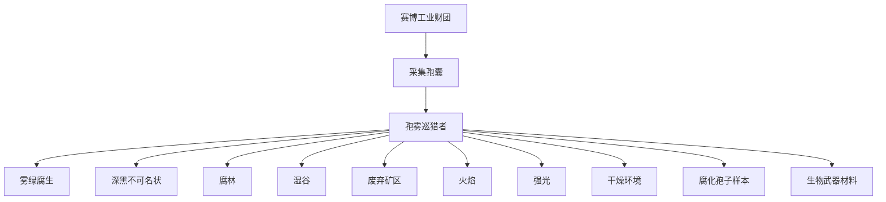

# 世界关系可视化

本页提供静态关系图；3D 版可打开 [黑曜纪元3D知识图谱.html](黑曜纪元3D知识图谱.html)，带节点图片、信息面板、搜索和类型筛选。真正的 2D 网状关系视图请看下方 SVG，交互版可打开 [黑曜纪元知识图谱网状视图.html](黑曜纪元知识图谱网状视图.html)。需要可拖拽编排的版本，请打开 [[黑曜纪元世界关系.canvas|黑曜纪元世界关系 Canvas]]。

## 3D 交互版
[打开 3D 知识图谱](黑曜纪元3D知识图谱.html)

## 网状视图
![[黑曜纪元知识图谱网状视图.svg]]

## 体系大图

## 视觉基底映射

## 孢雾巡猎者生态图

