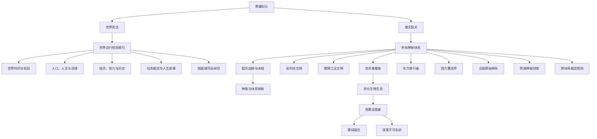

# 世界图谱

```mermaid
graph TD
  A[黑曜纪元] --> C0[世界宪法]
  C0 --> R0[世界运行规则索引]
  R0 --> T0[世界时间与轮回]
  R0 --> L0[人口、人生与法律]
  R0 --> E0[经济、势力与历史]
  R0 --> Q0[任务裁定与人生故事]
  R0 --> MC[镜面城可玩纵切]
  A --> B[诸天裂灾]
  B --> S[所有神秘体系]
  S --> N[裂灾血脉与本相]
  S --> C[高科技文明]
  S --> D[赛博工业文明]
  S --> E[克苏鲁眷族]
  S --> F[东方修行者]
  S --> G[西方魔法师]
  S --> H[北欧原始神系]
  S --> M[跨源神秘领域]
  S --> R[跨体系裁定规则]
  N --> X[种族与体系映射]
  E --> I[异化生物生态]
  I --> J[孢雾巡猎者]
  J --> K[雾绿腐生]
  J --> L[深黑不可名状]
```

## 使用方式
打开 Obsidian 的 Graph View 后，规则实现从 `世界运行规则索引` 与 `镜面城` 扩展；美术与生物创作从 `所有神秘体系`、`视觉基底索引` 或 `孢雾巡猎者` 扩展。
