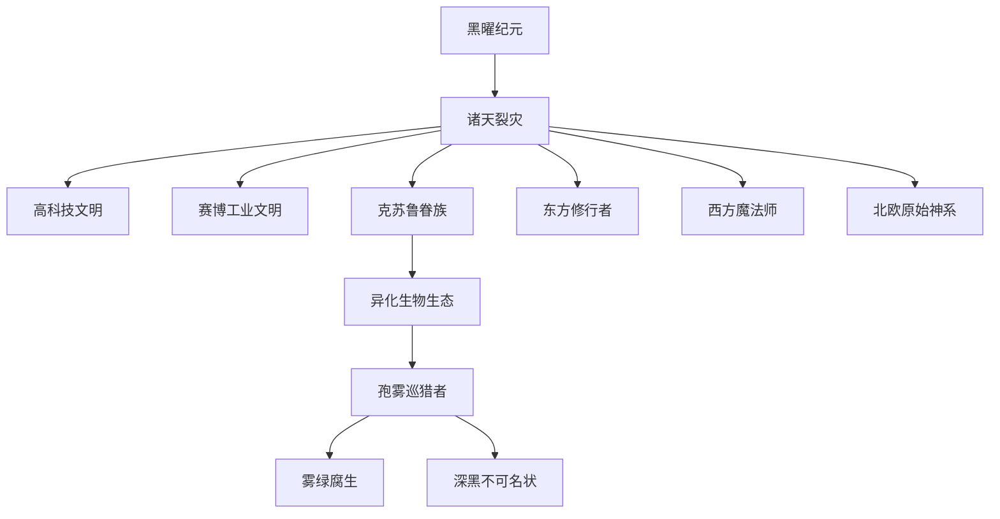

# 世界图谱

```mermaid
graph TD
  A[黑曜纪元] --> B[诸天裂灾]
  B --> C[高科技文明]
  B --> D[赛博工业文明]
  B --> E[克苏鲁眷族]
  B --> F[东方修行者]
  B --> G[西方魔法师]
  B --> H[北欧原始神系]
  E --> I[异化生物生态]
  I --> J[孢雾巡猎者]
  J --> K[雾绿腐生]
  J --> L[深黑不可名状]
```

## 使用方式
打开 Obsidian 的 Graph View 后，从 `黑曜纪元`、`诸天裂灾`、`雾绿腐生` 或 `孢雾巡猎者` 这些节点开始扩展。
