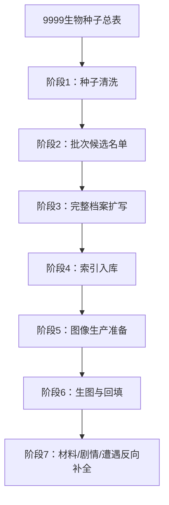

# 生物库生产流程

本流程用于把 [[9999生物种子总表]] 转化为可写剧情、可做遭遇、可生图、可反向产出材料和任务的完整生物库。[[300生物种子总表]] 保留为早期样本，后续大规模生产以 9999 种子库为主源表。

## 总流程



## 阶段1：种子清洗

目标：把种子从“名字列表”提升为“可靠候选池”。

输入：
- [[9999生物种子总表]]
- [[种族利用矩阵]]
- [[生物创作规范]]

动作：
- 检查是否贴合现有世界观。
- 检查名称是否独特、可记、可画。
- 检查层级是否合理，不能把普通生物写成首领，也不能把世界级写成空泛概念。
- 检查外观倾向和生物倾向是否真的多样。
- 标记需要改名、合并、降级、升级、拆分或淘汰的种子。

输出：
- `00_总览/9999生物种子清洗表.md`

验收：
- 9999 个种子都有清洗状态。
- 重名为 0。
- 每个种子都有明确母题、层级、外观倾向、生物倾向。

## 阶段2：批次候选名单

目标：从清洗后的 9999 个种子里抽出可扩写批次。

默认批次规模：
- 大规模档案批次：1000 个，用于直接形成可生图档案库。
- 标准批次：30 个。
- 小批次：10 个，用于试风格或局部生态。
- 首领批次：5 到 8 个，用于高层级剧情。

标准 30 个分配：
- 高科技与轨道文明：3
- 赛博工业与城市废土：3
- 克苏鲁 / 星外 / 深海梦境：3
- 诡秘 / 月光 / 镜像 / 身份：3
- 东方修行 / 宗门 / 妖庭：3
- 西方魔法 / 贵族 / 学院：3
- 北欧原始血裔 / 霜巨生态：3
- 海洋 / 深海 / 潮汐：3
- 地点生态 / 自然异化 / 灾后生态：3
- 世界级 / 跨体系 / 终局生命：3

输出：
- `00_总览/第N批生物候选名单.md`
- 首批大规模批次使用 `00_总览/第1批1000生物候选名单.md`

验收：
- 同批至少 5 种外观倾向。
- 同批至少 4 种生物倾向。
- 普通、精英、头目、首领或世界级有合理比例。
- 每个候选都说明为什么现在扩写。

## 阶段3：完整档案扩写

目标：把候选种子扩成可入库的完整 Markdown 条目。

每个完整档案必须包含：
- frontmatter：`type`、`base`、`habitat`、`threat`、`rank_role`、`alignment`、`visual_tendency`、`weakness`、`status`
- 一句话简介
- 关系接口
- 外观
- 行为
- 能力
- 弱点
- 可采集资源
- 遭遇事件
- 生图提示词要点
- 档案卡信息

输出：
- `04_生物单位/<生物名>.md`
- 大规模批次允许使用 `04_生物单位/B####_<生物名>.md`，H1 仍保留生物本名。

验收：
- 不少于 8 个结构段。
- 外观段含体型、轮廓、材质、颜色、器官、动态和视觉钩子。
- 如果有萌点，必须进入外观段。
- 高层级生物必须写清叙事影响。

## 阶段4：索引入库

目标：让生物能被世界观检索和使用。

必须更新：
- [[种族与势力索引]]
- 对应批次索引
- 必要时新增按体系、按地点、按层级、按外观倾向、按生物倾向、按可采集材料的索引。

输出：
- 批次索引页
- 必要的专题索引页

验收：
- 每个完整条目至少被 1 个总索引和 1 个专题索引引用。
- 种族、势力、地点或生态母题能双链回去。

## 阶段5：图像生产准备

目标：只有完整档案达标后才进入生图。

动作：
- 检查外观段是否足够可视化。
- 检查 `alignment` 与 `visual_tendency` 是否进入提示词。
- 给每个生物分配图像风格。
- 生成正面设定图 prompt 和档案卡 prompt。

输出：
- prompt 文件
- 生图队列 JSON
- 图像风格映射
- 首批 1000 使用 `node --import tsx tools/chatgpt_creature_image_batch.ts --all-bio-units` 生成队列。

验收：
- prompt 不依赖脚本默认倾向。
- 萌化、诡异、恶心、神圣等视觉重点进入外观核心，而不只在补充段。

## 阶段6：生图与回填

目标：生成图片并回填条目。

动作：
- 运行批量生图脚本。
- 保存正面设定图、档案卡。
- 回填 `node_image`、`panel_image`、`card_image`。
- 对失败项重试或退回阶段5修 prompt。

输出：
- `09_素材与图片/ChatGPT批量生成/results/`
- 已回填图片字段的生物条目

验收：
- 队列 done 数量与候选数量一致。
- failed 为 0，或有明确失败原因和重试计划。

## 阶段7：材料 / 剧情 / 遭遇反向补全

目标：让生物不只是图鉴，而是能服务剧情和玩法。

每个完整生物至少反向产出：
- 1 个可采集材料或器官。
- 1 个遭遇事件。
- 1 个剧情钩子。
- 1 个与种族、势力或地点的关系。

输出：
- 材料索引
- 遭遇索引
- 剧情钩子索引

验收：
- 生物能被用于探索、战斗、交易、仪式、任务或环境叙事中的至少一种。

## 批次执行清单

```markdown
## 第N批生物生产清单

- [ ] 从 [[9999生物种子总表]] 抽取候选
- [ ] 完成种子清洗
- [ ] 确认外观倾向覆盖
- [ ] 确认生物倾向覆盖
- [ ] 确认层级比例
- [ ] 扩写完整档案
- [ ] 更新索引
- [ ] 生成 prompt
- [ ] 跑生图队列
- [ ] 回填图片字段
- [ ] 补材料 / 遭遇 / 剧情钩子
- [ ] 完成批次验收
```

## 自动化执行

首批 9999 种子和 1000 可生图档案由脚本生成并校验：

```bash
python3 tools/build_biology_library.py
```

首批 1000 的 prompt 与生图队列由现有 ChatGPT 生图脚本读取 `04_生物单位`：

```bash
node --import tsx tools/chatgpt_creature_image_batch.ts --all-bio-units --limit 1000 --reset-queue --jobs 09_素材与图片/ChatGPT批量生成/biolibrary-1000-image-jobs.json --queue 09_素材与图片/ChatGPT批量生成/biolibrary-1000-image-queue.json
```
